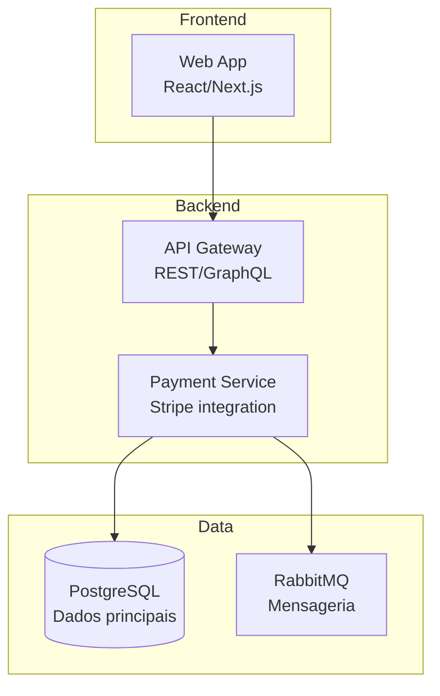
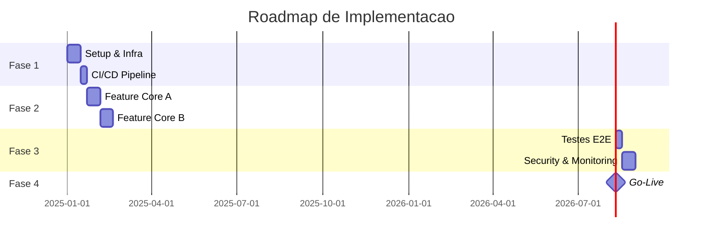

# spec — Geracao e Refinamento de Specs

O grupo de comandos `krab spec` gera, analisa e refina specs (especificacoes) a partir de templates estruturados. Cada template produz um documento Markdown completo com YAML frontmatter, pronto para consumo por agentes de IA ou equipes de desenvolvimento.

Se a **memory** do projeto estiver inicializada (`krab memory init`), os templates automaticamente incluem contexto do projeto como tech stack, convencoes, decisions e constraints.

```bash
krab spec --help
```

---

## krab spec new

Gera uma nova spec a partir de um dos 5 templates disponiveis. O arquivo de saida segue a convencao `spec.{tipo}.{slug}.md`.

### Sintaxe

```bash
krab spec new <template_type> [-n <nome>] [-d <descricao>] [-o <output>]
```

### Parametros

| Parametro | Tipo | Obrigatorio | Default | Descricao |
|-----------|------|-------------|---------|-----------|
| `template_type` | `string` | Sim | — | Tipo do template: `task`, `architecture`, `plan`, `skill`, `refining` |
| `-n` / `--name` | `string` | Nao* | — | Nome da spec (prompt interativo se omitido) |
| `-d` / `--desc` | `string` | Nao | `""` | Descricao da spec |
| `-o` / `--output` | `Path` | Nao | `spec.{tipo}.{slug}.md` | Caminho do arquivo de saida |

\* Se `--name` nao for fornecido, o Krab solicita interativamente via prompt.

### Contexto do Projeto (Memory)

Se o projeto tem memory inicializada (`.sdd/` existe), o template automaticamente:

1. Adiciona o **nome do projeto** ao YAML frontmatter (`project: nome`)
2. Insere uma secao **Contexto do Projeto** com tech stack, conventions e skills
3. Preenche campos especificos do template com dados da memory (ex: `architecture_style`, `constraints`, `decisions`)

Alem disso, a geracao e registrada no **historico** de specs (`.sdd/history.json`).

---

### Template: `task`

Gera uma spec de feature/task com cenarios **Gherkin** (BDD), criterios de aceitacao, casos de borda e definition of done.

**Arquivo de saida**: `spec.task.{slug}.md`

**Melhor para**: Features, user stories, bug fixes, qualquer unidade de trabalho implementavel.

#### Secoes Geradas

| Secao | Conteudo |
|-------|----------|
| **Visao Geral** | Objetivo, usuario-alvo, escopo (inclui/nao inclui), prioridade (P0-P3) |
| **Criterios de Aceitacao** | Lista de condicoes mensuraveis para a feature ser considerada completa |
| **Cenarios BDD (Gherkin)** | Feature completa com `Given/When/Then`, incluindo happy path, validacao de input invalido, autorizacao e `Scenario Outline` com `Examples` |
| **Casos de Borda** | Cenarios para timeout, concorrencia, volume extremo e rate limiting |
| **Notas Tecnicas** | Stack utilizada (auto-preenchida da memory), endpoints API (tabela), modelo de dados, regras de negocio |
| **Dependencias** | Specs relacionadas, servicos externos, bloqueios |
| **Definition of Done** | Checklist com testes, code review, docs, lint, deploy em staging, observabilidade |

#### Exemplo

```bash
krab spec new task -n "Login com MFA" -d "Implementar autenticacao multi-fator via TOTP"
```

**Saida:**

```
╭──────────────────────────────────╮
│  Spec Generator  type=task       │
╰──────────────────────────────────╯
✓ Spec gerada: spec.task.login-com-mfa.md
ℹ Template: spec.task | 4,231 chars
```

O arquivo gerado contem Gherkin pre-estruturado:

```gherkin
Feature: Login com MFA
  Como <tipo de usuario>
  Eu quero <acao desejada>
  Para que <beneficio esperado>

  Scenario: Fluxo principal (happy path)
    Given <pre-condicao estabelecida>
    And <outra pre-condicao>
    When <acao executada pelo usuario>
    Then <resultado esperado>

  Scenario: Validacao de entrada invalida
    Given <pre-condicao>
    When <acao com dados invalidos>
    Then <mensagem de erro especifica>
```

---

### Template: `architecture`

Gera uma spec de arquitetura com diagramas **Mermaid**, modelo **C4** (Context, Containers, Components), ADRs (Architecture Decision Records) e topologia de deploy.

**Arquivo de saida**: `spec.architecture.{slug}.md`

**Melhor para**: Design de sistemas, arquitetura de componentes, decisoes tecnicas, topologia de infraestrutura.

#### Secoes Geradas

| Secao | Conteudo |
|-------|----------|
| **Visao Geral** | Objetivo arquitetural, estilo (auto-preenchido da memory), principios de design, requisitos nao-funcionais (tabela: disponibilidade, latencia, throughput, escalabilidade, seguranca) |
| **Diagrama de Contexto (C4 Level 1)** | Diagrama Mermaid com usuarios, sistema principal e sistemas externos |
| **Diagrama de Containers (C4 Level 2)** | Diagrama Mermaid com frontend, backend, data layer e suas conexoes |
| **Diagrama de Componentes (C4 Level 3)** | Diagrama Mermaid com estrutura interna de um servico (Controller, Use Cases, Domain, Repository, Ports, Adapters) + tabela de responsabilidades |
| **Fluxo de Dados** | Diagramas de sequencia Mermaid para happy path sincrono e fluxo assincrono (com retry e DLQ) |
| **Modelo de Dados** | Diagrama ER Mermaid + decisoes de modelagem (UUIDs, timestamps, soft delete, audit trail) |
| **Contratos de API** | Exemplo de request/response em YAML, padroes de API (versionamento, paginacao, erros, rate limiting) |
| **Topologia de Deploy** | Diagrama Mermaid com load balancer, cluster de nodes, data layer e observability |
| **Seguranca** | Autenticacao/autorizacao, checklist OWASP Top 10 |
| **Decisoes Arquiteturais (ADRs)** | Template ADR (status, contexto, decisao, consequencias) + decisoes carregadas da memory |
| **Restricoes e Limites** | Constraints do projeto (da memory) + limites tecnicos |
| **Evolucao e Roadmap Tecnico** | Fases (MVP, Scaling, Maturity) + debitos tecnicos |

#### Exemplo

```bash
krab spec new architecture -n "Sistema de Pagamentos" -d "Arquitetura do modulo de pagamentos com integracao Stripe"
```

**Saida:**

```
╭───────────────────────────────────────╮
│  Spec Generator  type=architecture    │
╰───────────────────────────────────────╯
✓ Spec gerada: spec.architecture.sistema-de-pagamentos.md
ℹ Template: spec.architecture | 8,912 chars
```

O arquivo inclui diagramas Mermaid renderizaveis:



---

### Template: `plan`

Gera uma spec de plano de implementacao com fases, **Gantt chart** (Mermaid), avaliacao de riscos, milestones e alinhamento com a arquitetura existente.

**Arquivo de saida**: `spec.plan.{slug}.md`

**Melhor para**: Sprint planning, roadmaps de projeto, planos de execucao, estimativas.

#### Secoes Geradas

| Secao | Conteudo |
|-------|----------|
| **Objetivo do Plano** | Problema, resultado esperado, metricas de sucesso (tabela: metrica, baseline, meta, prazo), escopo |
| **Avaliacao de Skills** | Skills disponiveis (auto-carregadas da memory/skills), mapa de competencias vs necessidades (tabela com gaps e acoes), decisao sobre gaps |
| **Alinhamento com Arquitetura** | Estilo vigente (da memory), specs de arquitetura referenciadas, componentes afetados, conformidade arquitetural (checklist) |
| **Fases de Implementacao** | 4 fases detalhadas com cenarios Gherkin por fase: Fundacao (Sprint 1-2), Core Features (Sprint 3-5), Hardening (Sprint 6-7), Go-Live (Sprint 8) |
| **Milestones** | Gantt chart Mermaid + tabela de milestones com criterios de aceite e datas-alvo |
| **Avaliacao de Riscos** | Tabela de riscos (probabilidade, impacto, mitigacao) + plano de contingencia |
| **Recursos Necessarios** | Time (tabela: papel, quantidade, alocacao, fase), infraestrutura, budget estimado |
| **Timeline** | Tabela semana a semana com atividades e entregas |
| **Criterios de Sucesso** | Criterios tecnicos (testes, SLA, CI/CD) e de negocio (stakeholders, metricas, docs) |

#### Exemplo

```bash
krab spec new plan -n "Migracao para Microservices" -d "Plano de migracao gradual do monolito para microservices"
```

**Saida:**

```
╭──────────────────────────────────╮
│  Spec Generator  type=plan       │
╰──────────────────────────────────╯
✓ Spec gerada: spec.plan.migracao-para-microservices.md
ℹ Template: spec.plan | 6,847 chars
```

O Gantt chart gerado e renderizavel em Mermaid:



---

### Template: `skill`

Gera uma spec de skills e capabilities do projeto, documentando linguagens, frameworks, patterns, ferramentas, infraestrutura e convencoes.

**Arquivo de saida**: `spec.skill.{slug}.md`

**Melhor para**: Documentar capabilities do time, alimentar o `spec.plan` com gap analysis, onboarding de novos membros.

#### Secoes Geradas

| Secao | Conteudo |
|-------|----------|
| **Linguagens** | Tabela (linguagem, versao, nivel, uso) + convencoes de linguagem |
| **Frameworks e Bibliotecas** | Tabelas separadas para backend, frontend e bibliotecas transversais |
| **Patterns e Praticas** | Checklists de patterns arquiteturais (Hexagonal, CQRS, DDD, etc.), de desenvolvimento (SOLID, TDD, BDD, Feature Flags) e de API design (REST, GraphQL, gRPC, OpenAPI) |
| **Ferramentas** | Tabelas de ferramentas de desenvolvimento, CI/CD e observabilidade |
| **Infraestrutura** | Cloud & servicos (tabela: servico, provider, tier) + ambientes (tabela: ambiente, URL, proposito, auto-deploy) |
| **Convencoes do Projeto** | Convencoes da memory (auto-preenchidas) + Git (branching, commits, PR, merge), codigo (naming, estrutura, testes, erros, logs) e documentacao |
| **Contexto do Time** | Dados do time da memory + perfil (tamanho, senioridade, fuso, cerimonias) + areas de expertise (tabela) |
| **Plano de Crescimento de Skills** | Gaps identificados (tabela com nivel atual, desejado, estrategia, prazo), recursos de aprendizado, spikes tecnicos |

#### Exemplo

```bash
krab spec new skill -n "Backend Team" -d "Skills e capabilities do time de backend"
```

**Saida:**

```
╭──────────────────────────────────╮
│  Spec Generator  type=skill      │
╰──────────────────────────────────╯
✓ Spec gerada: spec.skill.backend-team.md
ℹ Template: spec.skill | 5,423 chars
```

---

### Template: `refining`

Gera uma analise de refinamento **Tree-of-Thought** com 5 dimensoes de avaliacao. Quando usado via `krab spec new refining`, gera um template em branco. Para analise automatica de uma spec existente, use `krab spec refine`.

**Arquivo de saida**: `spec.refining.{slug}.md`

**Melhor para**: Melhorar specs existentes, identificar gaps, reduzir risco de hallucination em agentes.

#### Dimensoes de Analise

O template em branco inclui checklists para as 5 dimensoes:

1. **Completude Estrutural** — Todas as secoes presentes? Placeholders preenchidos? Cenarios suficientes?
2. **Precisao e Especificidade** — Termos vagos substituidos? Requisitos mensuraveis? Limites explicitos?
3. **Coerencia Interna** — Referencias cruzadas consistentes? Terminologia uniforme? Modelo suporta cenarios?
4. **Prontidao para Agente** — Token count dentro da janela? Texto claro? Contexto implicito explicitado?
5. **Testabilidade** — Cada requisito tem cenario Gherkin? Criterios atomicos? Edge cases documentados?

#### Exemplo

```bash
krab spec new refining -n "Revisao Auth" -d "Template para refinamento da spec de autenticacao"
```

**Saida:**

```
╭────────────────────────────────────╮
│  Spec Generator  type=refining     │
╰────────────────────────────────────╯
✓ Spec gerada: spec.refining.revisao-auth.md
ℹ Template: spec.refining | 2,108 chars
```

---

## krab spec refine

Analisa uma spec existente utilizando a abordagem **Tree-of-Thought (ToT)** e gera um documento de refinamento com perguntas estruturadas, gaps criticos e ordem sugerida de melhoria.

### Sintaxe

```bash
krab spec refine <file> [-o <output>]
```

### Parametros

| Parametro | Tipo | Obrigatorio | Default | Descricao |
|-----------|------|-------------|---------|-----------|
| `file` | `Path` | Sim | — | Spec a ser analisada |
| `-o` / `--output` | `Path` | Nao | `spec.refining.{stem}.md` | Arquivo de saida |

### Como o Tree-of-Thought Funciona

A abordagem ToT (Tree-of-Thought) explora multiplos caminhos de raciocinio para cada dimensao de analise:

1. **DECOMPOSE** — A spec e decomposta em 5 dimensoes de concern
2. **BRANCH** — Para cada dimensao, multiplas perspectivas sao exploradas
3. **EVALUATE** — Cada branch recebe um score de completude e prioridade
4. **SYNTHESIZE** — Os melhores insights sao consolidados em recomendacoes

### As 5 Dimensoes de Analise

#### 1. Completude Estrutural

Verifica se todas as secoes esperadas para o tipo de spec estao presentes:

- **Para `task`**: Conta cenarios Gherkin (0 = 30% completo, menos de 3 = 60%, 3 ou mais = 80%)
- **Para `architecture`**: Conta diagramas Mermaid (0 = 30%, 1 ou mais = 70%)
- **Para `plan`**: Verifica presenca de timeline/gantt/milestones (sem = 40%, com = 70%)
- Conta **placeholders** nao preenchidos (`TBD`, `TODO`, `FIXME`)
- Avalia numero de headings (menos de 3 = estrutura insuficiente)

#### 2. Precisao e Especificidade

Utiliza internamente `krab analyze ambiguity` para detectar:

- Termos vagos de **alta severidade** (aumentam risco de hallucination)
- Falta de mensurabilidade nos requisitos
- Ausencia de limites numericos, formatos de dados e valores concretos

Perspectivas geradas:
- **Termos vagos de alta severidade** [prioridade: critical]
- **Mensurabilidade** [prioridade: high]

#### 3. Coerencia Interna

Verifica consistencia entre as partes da spec:

- **Referencias cruzadas**: Endpoints mapeiam para cenarios Gherkin? Modelo de dados suporta os campos necessarios?
- **Consistencia terminologica**: Mesmo conceito usa o mesmo termo em toda a spec? Ha mistura de idiomas?

#### 4. Prontidao para Agente IA

Avalia se a spec esta otimizada para consumo por agentes:

- **Eficiencia de tokens**: Spec com >4000 tokens gera alertas; >8000 gera prioridade high
- **Clareza textual**: Flesch-Kincaid grade >16 indica texto muito complexo
- **Contexto explicito**: Agentes nao tem contexto implicito — toda informacao deve estar na spec

#### 5. Testabilidade

Avalia se os requisitos sao verificaveis:

- **Cobertura de cenarios**: Happy path? Erros com mensagens especificas? Edge cases?
- **Criterios de aceitacao**: Existem? Sao atomicos e independentes?
- `Scenario Outline` para variacoes parametricas?

### Perguntas Geradas

Cada branch gera **perguntas acionaveis** com prioridade:

| Icone | Prioridade | Significado |
|-------|------------|-------------|
| `[!!]` | critical | Impede o agente de implementar corretamente |
| `[!]` | high | Risco significativo de hallucination ou implementacao incorreta |
| `[~]` | medium | Melhoria importante mas nao bloqueante |
| `[.]` | low | Nice-to-have, melhoria incremental |

### Gaps Criticos

O Krab identifica gaps criticos quando:
- Uma dimensao tem **completude abaixo de 40%**
- Um branch tem **prioridade critical**

### Iteracoes Estimadas

O numero estimado de iteracoes de refinamento e calculado como:

```
estimated_iterations = max(1, total_questions / 5)
```

Ou seja, assumindo que voce resolve ~5 perguntas por rodada de refinamento.

### Exemplo Completo

```bash
krab spec refine spec.task.checkout-flow.md
```

**Saida no terminal:**

```
╭────────────────────────────────────────────╮
│  Spec Refiner (Tree-of-Thought)            │
│  spec.task.checkout-flow.md                │
╰────────────────────────────────────────────╯
ℹ Tipo detectado: spec.task
ℹ Perguntas geradas: 23
ℹ Iteracoes estimadas: 4
⚠ Gaps criticos: 2
  • Precisao e Especificidade/Termos vagos de alta severidade
  • Testabilidade/Criterios de aceitacao
✓ Refinamento salvo: spec.refining.checkout-flow.md
```

**Conteudo do arquivo gerado (resumido):**

```markdown
---
title: checkout-flow
type: spec.refining
date: 2026-02-24
status: draft
---

# Refinamento: checkout-flow

> Analise Tree-of-Thought para refinamento de spec.
> Tipo detectado: **spec.task**
> Total de perguntas: **23**
> Iteracoes estimadas: **4**

## [!] Gaps Criticos

- **Precisao e Especificidade/Termos vagos de alta severidade**
- **Testabilidade/Criterios de aceitacao**

## Ordem Sugerida de Refinamento

1. Completude Estrutural
2. Precisao e Especificidade
3. Testabilidade
4. Prontidao para Agente IA
5. Coerencia Interna

## Completude Estrutural

> Verifica se todas as secoes esperadas estao presentes e preenchidas.
> Completude: **60%**

- [ ] Apenas 2 cenario(s) Gherkin. Considerar: happy path, erro, edge case.

### [!] Perspectiva: Preenchimento

**Pensamento**: Ha 14 placeholders nao preenchidos. Secoes com <!-- --> precisam de conteudo real.

**Perguntas para explorar:**

- [ ] Quais placeholders sao criticos para o entendimento do agente?
- [ ] Algum placeholder pode ser removido por nao se aplicar ao projeto?
- [ ] Ha informacoes no projeto (memory/skills) que ja respondem esses placeholders?

## Precisao e Especificidade

> Avalia se a linguagem e precisa o suficiente para evitar ambiguidade.
> Completude: **72%**

### [!!] Perspectiva: Termos vagos de alta severidade
...

## Proximos Passos

1. Responda as perguntas marcadas como [!!] (critico) primeiro
2. Use `krab spec refine <arquivo>` novamente apos cada rodada
3. Quando todas as perguntas forem resolvidas, rode `krab analyze risk` para validar
4. Atualize a spec original com as respostas
```

### Fluxo de Refinamento Iterativo

```bash
# Rodada 1: Analisar spec original
krab spec refine spec.task.feature-x.md

# (editar spec.task.feature-x.md respondendo perguntas [!!] e [!])

# Rodada 2: Re-analisar
krab spec refine spec.task.feature-x.md

# (repetir ate gaps criticos = 0)

# Validacao final
krab analyze risk spec.task.feature-x.md
krab analyze ambiguity spec.task.feature-x.md
```

---

## krab spec list

Lista todos os templates de spec disponiveis no registry.

### Sintaxe

```bash
krab spec list
```

### Parametros

Nenhum.

### Exemplo

```bash
krab spec list
```

**Saida:**

```
╭──────────────────────────────────────╮
│  Spec Templates                      │
│  Available templates                 │
╰──────────────────────────────────────╯

┌────────────────────┬────────────────────────────────────────┬──────────────────────────────────────────────────────────┐
│ Type               │ Command                                │ Description                                              │
├────────────────────┼────────────────────────────────────────┼──────────────────────────────────────────────────────────┤
│ spec.architecture  │ krab spec new architecture -n "nome"   │ Architecture spec with Mermaid diagrams, C4 model, ADRs  │
│ spec.plan          │ krab spec new plan -n "nome"           │ Implementation plan referencing skills + architecture     │
│ spec.refining      │ krab spec new refining -n "nome"       │ Tree-of-Thought spec refinement with structured          │
│                    │                                        │ questioning                                              │
│ spec.skill         │ krab spec new skill -n "nome"          │ Project skills, capabilities, patterns, and conventions  │
│ spec.task          │ krab spec new task -n "nome"           │ Feature/task spec with Gherkin BDD scenarios             │
│                    │                                        │ (Given/When/Then)                                        │
└────────────────────┴────────────────────────────────────────┴──────────────────────────────────────────────────────────┘
```

---

## Anatomia de uma Spec Gerada

Toda spec gerada pelo Krab segue uma estrutura padronizada:

### YAML Frontmatter

```yaml
---
title: Nome da Spec
type: spec.task          # spec.task | spec.architecture | spec.plan | spec.skill | spec.refining
date: 2026-02-24         # Data de geracao (UTC)
project: meu-projeto     # Presente apenas se memory esta inicializada
status: draft            # Status inicial sempre e "draft"
---
```

Os campos do frontmatter sao:

| Campo | Descricao | Origem |
|-------|-----------|--------|
| `title` | Nome fornecido via `--name` | Parametro do usuario |
| `type` | Tipo do template (prefixado com `spec.`) | Template selecionado |
| `date` | Data de geracao em formato ISO (YYYY-MM-DD) | Automatico (UTC) |
| `project` | Nome do projeto | `krab memory` (se inicializada) |
| `status` | Status do ciclo de vida da spec | Sempre `draft` inicialmente |

### Estrutura Markdown

```markdown
---
(frontmatter YAML)
---

# Titulo da Spec

> Descricao fornecida pelo usuario.

## Contexto do Projeto        ← Somente se memory esta inicializada

```                            ← Bloco com tech stack, conventions, skills
Project: meu-projeto
Tech Stack: ...
```                            (fim do bloco de contexto)

## Secao 1                     ← Secoes especificas do template
...

## Secao 2
...

## Secao N
...
```

### Convencao de Nomes de Arquivo

O nome do arquivo segue o padrao:

```
spec.{tipo}.{slug}.md
```

Onde:
- `{tipo}` e o template type (`task`, `architecture`, `plan`, `skill`, `refining`)
- `{slug}` e o nome convertido para lowercase, com caracteres especiais substituidos por hifens

| Nome | Slug | Arquivo |
|------|------|---------|
| Login com MFA | login-com-mfa | `spec.task.login-com-mfa.md` |
| Sistema de Pagamentos | sistema-de-pagamentos | `spec.architecture.sistema-de-pagamentos.md` |
| Sprint 04 - Q1 2026 | sprint-04-q1-2026 | `spec.plan.sprint-04-q1-2026.md` |

### Placeholders

Templates usam comentarios HTML como placeholders para indicar onde o usuario deve preencher:

```markdown
### Objetivo
<!-- Qual problema esta feature resolve? -->
```

Use `krab spec refine` para identificar placeholders nao preenchidos e receber sugestoes de melhoria.

---

## Referencia Rapida

```bash
# Gerar spec de feature com Gherkin
krab spec new task -n "Checkout Flow" -d "Fluxo de compra completo"

# Gerar spec de arquitetura com diagramas C4
krab spec new architecture -n "Payment Service" -d "Microservico de pagamentos"

# Gerar plano de implementacao com Gantt
krab spec new plan -n "Migracao v2" -d "Plano de migracao do monolito"

# Documentar skills do time
krab spec new skill -n "Platform Team" -d "Skills e ferramentas do time de plataforma"

# Gerar template de refinamento em branco
krab spec new refining -n "Review Auth" -d "Checklist de refinamento"

# Analisar spec existente com Tree-of-Thought
krab spec refine spec.task.auth-flow.md -o refinamento-auth.md

# Listar todos os templates
krab spec list

# Especificar arquivo de saida customizado
krab spec new task -n "Login" -o specs/features/login.md
```
